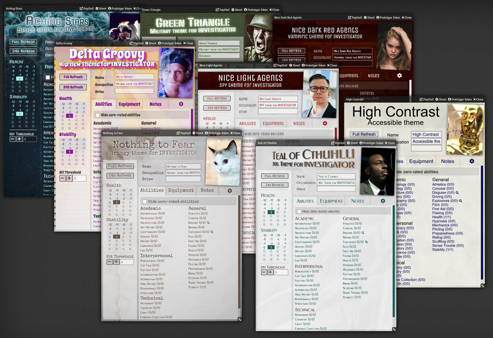

# INVESTIGATOR System for Foundry VTT

Unofficial GUMSHOE SRD-compatible system for Foundry VTT. Ships with compatiblity for several settings, and can be customized to work with any other setting. Rules relating to anything outside of the character sheet are not included, so you'll need to own a compatible game in order to play.

Includes 7 character sheet themes plus an extra high-contrast accessible theme.



[(Full size image)](assets/screenshots/theme_lineup.webp)

## Contents
- [INVESTIGATOR System for Foundry VTT](#investigator-system-for-foundry-vtt)
  - [Contents](#contents)
  - [Features](#features)
  - [How to install](#how-to-install)
  - [Using the built-in game systems](#using-the-built-in-game-systems)
  - [How to add the missing abilities](#how-to-add-the-missing-abilities)
  - [Translations](#translations)
  - [Setting up any system that isn't built in](#setting-up-any-system-that-isnt-built-in)
  - [Creating Characters](#creating-characters)
  - [Using Abilities](#using-abilities)
  - [Party Tracker](#party-tracker)
  - [Bug reports and contact](#bug-reports-and-contact)
  - [Development & general hacking](#development--general-hacking)
  - [Credits](#credits)
    - [GUMSHOE SRD Creative Commons](#gumshoe-srd-creative-commons)


## Features

* A character sheet which tracks ratings and pools for all your Investigative and General abilities!
* Spend pool points!
* Roll general ability tests!
* Refresh an individual ability or refresh all your pools at once!
* Built-in support for several systems:
  * "Path" of Cthulhu
  * "Nice" Black Agents
  * "Pallid" Stars
  * "Nothing to Fear"
  * More coming soon!
* Fully extensible to support any GUMSHOE-compatible game
* Party tracker (aka investigator matrix)
* Visual themes for character sheets based on the built-in systems.
* A high-contrast, (hopefully) accessibility-enhanced theme.
* A sinister dark red version of one of the themes.


## How to install

I'm going to assume you have a working knowledge of [Foundry VTT](https://foundryvtt.com/), and the concepts it uses, like systems, modules, and worlds.

This sytem isn't registered so to install it into your Foundry instance:

1. On the admin screen, got to **Game Systems**
2. Click **Install System**
3. Where it says **Manfest URL**, paste in

    ```
    https://gitlab.com/n3dst4/investigator-fvtt/-/raw/release/src/system.json
    ```
    
4. Click **Install**

Now you can create a new world and choose this as the system.

If you've been using the precusor to the system, "T**** of Cthulhu Unsanctioned", see [UPGRADING](./UPGRADING.md) for info about how to upgrade existing worlds to this new system.


## Using the built-in game systems

The system comes preconfigured for **Path of Cthulhu**. If that's what you want to play, you can skip this section and move ahead to [Making PCs](#making-pcs).

If you want to use one of the other built-in systems, open the Settings sidebar tab and look for the **INVESTIGATOR System Settings** button. Click this to open the configuration. You can ignore 90% of this window and just choose one of the presets at the top! If you want to tweak the other setting can can do so.

HOWEVER.

You may be wondering why the ability compendiums supplied with this system seem to be missing certain abilities.

**The reason**: because this is an unofficial system, we can only ship abilities that appear in the [GUMSHOE SRD][srd]. The SRD is fantastic document which lists many abilities, but not not all of them. So we've had to leave several out.


## How to add the missing abilities

1. In the Items tab, create a new folder. Give it a name like "Cthulhu extra abilities" or whatever.
2. Add abilities as follows:

    1. Click "New Item" (looks like a quill pen) next to the folder name.
    2. Pick "investigativeAbility" or "generalAbility"
    3. Configure the ability as needed.
    4. Repeat until you have all the additional abilities you need.

3. Right-click the folder and Export to Compendium.
4. Flip over to the Game Settings tab and click INVESTIGATOR System Setting.
5. Pick a the System Preset that you want.
6. See where it says Compendium packs for new PCs? Put a tick (check) next to the name of your new "Extra abilities" compendium.

Done! New PCs will now automatically be given the abilities in your new compendium. Also, if you create a party tracker, it will show those abilities in the list.

## Translations

Thanks to Foundry's translation systems, plus the excellent [Babele](https://gitlab.com/riccisi/foundryvtt-babele) module, and the enormous contributions from many volunteers, INVESTIGATOR will work in more languages than just my native English! Check out the [Translations page on the wiki](https://gitlab.com/n3dst4/investigator-fvtt/-/wikis/Translations) to see what has been translated into which languages and get instructions if you'd like to contribute a translation.


## Setting up any system that isn't built in

The basic idea is that all character abilities are "Items" in Foundry VTT-speak.

The abilities that get added to a newly-created character all have to come from a **Compendium pack** (of type **"Item"**).

So, first up, create a compendium pack to house your custom abilities. Give it a name like "Exampleshoe Abilities", if you're going to play Exampleshoe. You don't need to fill in the abilities yet.

Now open the **Game Settings** sidebar tab and look for the **INVESTIGATOR System Settings** button. Click this to open the configuration. Pick any built-in system as a starting point, then customize the fields as you need to match your needs:

* **Visual Theme** We ship with a handful of visual themes to support our built-in systems. You can pick whichever one you like.
* **Compendium packs for new PCs** This is a really important one. This selects what abilities will be automatically added to newly-created characters. Select the compendium you created for your custom abilities and **UNSELECT** everything else. You *could* leave multiple packs selected but you probably don't want to.
* **Investigative Ability Categories** These are just the headings that investigative abilities can appear under. It's worth noting that any ability can define its own category, so this setting is mainly for convenience when you're setting up new abilities/
* **General Ability Categories** Like above, but for General abilities. Many games only have one category for General abilities, called "General".
* **Combat Abilities** This is a list of the abilities (by name) which can be used to make attacks in combat. 
* **Short notes fields** A list of all the "small" text fields on the character sheet, after **Name** and **Occupation**. This is for short bits of text like "Drive" and "Previous Patron".
* **Long notes fields** A list of all the long text areas on the character sheet, like "Notes", "Background", "Contacts" etc.

Now you can create the abilities you need as items in the **Items directory**, and then add them to your compendium pack. 

* **Pool** and **Rating** should be clear if you're familiar with investigative game systems like this. Set the rating of you want characters to automatically start with a certain amount in that ability. Set the pool to match if you like, so they don't start out with an empty pool.

Click the cog to see all the other config for an ability:

* **Name** e.g. "Philately", "Rock climbing" (you can also type this in directly at the top of the window)
* **Category** the drop-down will give you quick access to at thw **ability categories** you set up before. Abilities can also have custom categories.
* **Min** and **Max** Some abilities can go negative, like Health and Stability, so you can give them a negative Min here. The Max is probably overkill and will likely be removed in a future update.
* **Has Specialities?** If ticked, you will be able to add individual specialities to the ability. This is for abilities like **Language**, where yuou can add the individual languages your character knows.
* **Occupational?** This is more for use when you're setting up an individual character - you can mark an ability as occupational fopr your own reference. We don't support points-based character generation (yet) so this is just for informational purposes.
* **Can be investigative?** Another informational field. Some General Abilities are deemed to have an investigative usage, so they can be used "just by having them".
* **Show Tracker?** Another important one - if ticked, the character sheet will show a clickable pool tracker for this ability. This is key for abilities like Health, Sanity, etc.


## Creating Characters

Create a character int he normal way, through the **Actors directory**. It should be pre-populated with the right abilities for your system.

Most of the character shjeet should be self explanatory. Watch out for the Nuke button (hidden away on the settings tab of the character sheet) - it will blow away all your character's abilities and equipment.

## Using Abilities

Using Investigative abilities doesn't require any active effort - you just tell the GM that you're using `Geology` or whatever.

If you want **spend points**, open the ability from your character sheet and shoose the number of points to spend.

General abilities can also be **rolled** - choose the number of points to expend and click **Test**.

## Party Tracker

As a GM, maybe you want to see a quick overview of all the abilities your players have between them, to make sure all your investigative bases are covered. This is sometimes called an "investigator matrix".

To create a party tracker:

1. Create a new actor, and choose "party" as the type.
2. The "sheet" for this party will open, showing you all the standard abilities configured at the moment.
3. **Drag** PC actors from the sidebar into the party tracker sheet to add them.
4. You can directly pop open a character's ability from the tracker, for rapid adjusting.
5. Totals adjust in real-time as you edit abilities.

You can create multiple "party" actors if you want to tracks different groups of PCs as needed for your campaign.


## Bug reports and contact

If you have a GitLab account, then by all means log an issue over at [the project site][project-site]. Merge requests are also welcome!

Otherwise you can email me at `neil at lumphammer.com`, or hit me up on Discord (search for `n3dst4#8227`.)


## Development & general hacking

If you're a developer and you'd like to hack on this code, please be aware it uses Webpack and React so some of it will not look like normal Handlebars + JQuery Foundry stuff.

1. Clone the repo.
2. Copy `foundryconfig_template.json` to `foundryconfig.json` and edit it to fill in the `dataPath`, e.g.  `"dataPath" "/home/ndc/foundrydata",`.
3. `npm i` to install dependencies
4. `npm run build` to do a build
5. `npm run link` to link it into your foundry data folder
6. `npm start` to start a live incremental build (so you don't need to keep running `npm run build` after every change).
7. Open your local foundry server and create a world using this as the system.


## Credits

<span>Photo by <a href="https://unsplash.com/@anniespratt?utm_source=unsplash&amp;utm_medium=referral&amp;utm_content=creditCopyText">Annie Spratt</a> on <a href="https://unsplash.com/?utm_source=unsplash&amp;utm_medium=referral&amp;utm_content=creditCopyText">Unsplash</a></span>

<span>Photo by <a href="https://unsplash.com/@marjan_blan?utm_source=unsplash&amp;utm_medium=referral&amp;utm_content=creditCopyText">Марьян Блан | @marjanblan</a> on <a href="https://unsplash.com/?utm_source=unsplash&amp;utm_medium=referral&amp;utm_content=creditCopyText">Unsplash</a></span>

<span>Photo by <a href="https://unsplash.com/@leyameera?utm_source=unsplash&amp;utm_medium=referral&amp;utm_content=creditCopyText">Tina Dawson</a> on <a href="https://unsplash.com/?utm_source=unsplash&amp;utm_medium=referral&amp;utm_content=creditCopyText">Unsplash</a></span>

<span>Photo by <a href="https://unsplash.com/@seresigo?utm_source=unsplash&amp;utm_medium=referral&amp;utm_content=creditCopyText">Philipp Trubchenko</a> on <a href="https://unsplash.com/?utm_source=unsplash&amp;utm_medium=referral&amp;utm_content=creditCopyText">Unsplash</a></span>

<span>Photo by <a href="https://unsplash.com/@guillepozzi?utm_source=unsplash&amp;utm_medium=referral&amp;utm_content=creditCopyText">guille pozzi</a> on <a href="https://unsplash.com/?utm_source=unsplash&amp;utm_medium=referral&amp;utm_content=creditCopyText">Unsplash</a></span>

<span>Photo by <a href="https://unsplash.com/@remiskatulski?utm_source=unsplash&utm_medium=referral&utm_content=creditCopyText">remi skatulski</a> on <a href="https://unsplash.com/s/photos/mystery?utm_source=unsplash&utm_medium=referral&utm_content=creditCopyText">Unsplash</a></span>

Photo by <a href="https://unsplash.com/@stilclassics?utm_source=unsplash&utm_medium=referral&utm_content=creditCopyText">STIL</a> on <a href="https://unsplash.com/?utm_source=unsplash&utm_medium=referral&utm_content=creditCopyText">Unsplash</a>

Photo by <a href="https://unsplash.com/@sammywilliams?utm_source=unsplash&utm_medium=referral&utm_content=creditCopyText">Sammy Williams</a> on <a href="https://unsplash.com/?utm_source=unsplash&utm_medium=referral&utm_content=creditCopyText">Unsplash</a>
  
Photo by <a href="https://unsplash.com/@kiwihug?utm_source=unsplash&utm_medium=referral&utm_content=creditCopyText">Kiwihug</a> on <a href="https://unsplash.com/?utm_source=unsplash&utm_medium=referral&utm_content=creditCopyText">Unsplash</a>

Photo by <a href="https://unsplash.com/@scottwebb?utm_source=unsplash&utm_medium=referral&utm_content=creditCopyText">Scott Webb</a> on <a href="https://unsplash.com/s/photos/granite?utm_source=unsplash&utm_medium=referral&utm_content=creditCopyText">Unsplash</a>

Photo by <a href="https://unsplash.com/@meric?utm_source=unsplash&utm_medium=referral&utm_content=creditCopyText">Meriç Dağlı</a> on <a href="https://unsplash.com/s/photos/texture?utm_source=unsplash&utm_medium=referral&utm_content=creditCopyText">Unsplash</a>


Illustrations from [Old Book Illustrations](https://www.oldbookillustrations.com/).

Huge thanks to Nick van Oosten/NickEast for [Foundry Project Creator](https://gitlab.com/foundry-projects/foundry-pc/create-foundry-project) and [the Typescript types to go with it](https://gitlab.com/foundry-projects/foundry-pc/foundry-pc-types).

Current types are provided by the excellent [League of Foundry Developers](https://github.com/League-of-Foundry-Developers/foundry-vtt-types).

Icons are created on https://game-icons.net/ and used under the [CC-BY-3.0 Creative Commons licence](https://creativecommons.org/licenses/by/3.0/).

Thanks to [The Design Mechanism](https://thedesignmechanism.com) for permission to use the ability list from Casting the Runes.

### GUMSHOE SRD Creative Commons

This work is based on the GUMSHOE SRD (found at http://www.pelgranepress.com/?p=12466), a product of Pelgrane Press, developed, written, and edited by Robin D. Laws with additional material by Kenneth Hite, and licensed for our use under the Creative Commons Attribution 3.0 Unported license (http://creativecommons.org/licenses/by/3.0/)


[project-site]: https://gitlab.com/n3dst4/investigator-system/-/issues
[srd]: https://site.pelgranepress.com/index.php/the-gumshoe-system-reference-document/
